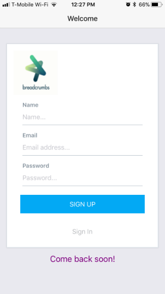
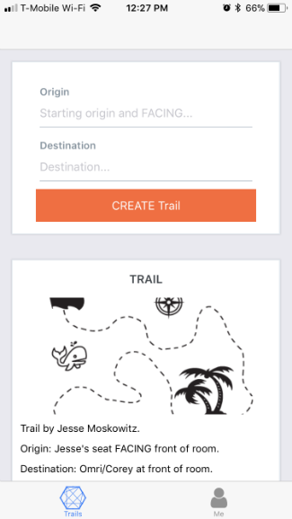
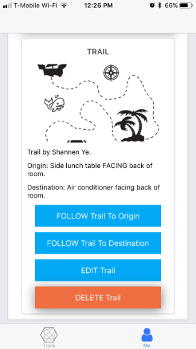
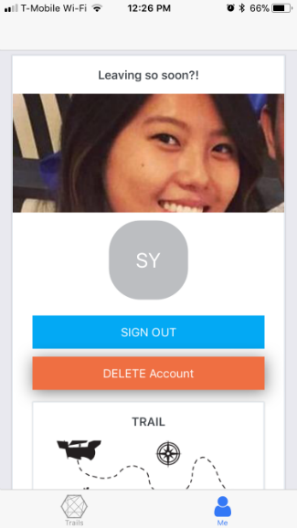

# Welcome to _Breadcrumbs_

Fullstack Academy of Code (Cohort 1710) - Capstone Project

Team I:  Kevin Ho, Shannen Ye, Jesse Moskowitz, Vanessa Jimenez

Our Instructors:  Corey Greenwald & Omri Bernstein

Our Team Fellow:  Jannine Chan

[Deployed Frontend on EXPO](https://expo.io/@hokevins/breadcrumbs)

[Deployed Backend on Heroku](https://breadcrumbs.herokuapp.com/)

[Project Github](https://github.com/fsa-1710-breadcrumbs)

Breadcrumbs is an augmented reality React-Native iOS app inspired by Hansel and Gretel.  Users can create or follow a trail of AR breadcrumbs, rendered as 3D floating orbs through your phone's camera.  Being independent of a map-based API, our app utilizes your relative location to provide small scale accuracy where Google Maps would fail.  Or if you're feeing adventurous, follow another user's trail to explore the road best travelled.  Breadcrumbs is your beacon back home.

## Background

* Breadcrumbs daringly uses experimental technologies like EXPO-Three.js, in conjunction with some libraries (EXPO-ARKit) which are only a few months old within the React-Native environment.

* Rather than relying on geolocation, we made the choice to leverage EXPO-Three.js in order to gather relative location data for small scale exact accuracy (i.e. looking for your car in a parking garage, first-time student at Fullstack looking for the Oasis.)

* As our Capstone, we wanted to explore new libraries like ARKit, Three.js, Expo-Three.js, React-Native & Expo.io combined with all of the technologies we know and love on the stack like Express.js and Sequelize.js.

## Specs

This project was bootstrapped with [Create React Native App](https://github.com/react-community/create-react-native-app).

Currently, React Native does not support npm version 5.x+.
We recommend using a Node/NPM version manager like 'n'.
Simply run `npm install -g n` to install 'n' globally.
Running the following commands will tell you what versions you currently have:
```
node -v
npm -v
```
You should see node version v7.7.4 and npm 4.1.2 if you run `sudo n 7.7`.
If you ever want to switch back to the latest version (or you just want to update to the latest version) just run `sudo n latest`.

In the development process, we also recommend using Expo's iOS & Android simulator for quick feedback and testing.

You should only need to update the global installation of `create-react-native-app` very rarely, ideally never.

Updating the `react-native-scripts` dependency of your app should be as simple as bumping the version number in `package.json` and reinstalling your project's dependencies.

## Available Scripts

If Yarn was installed when the project was initialized, then dependencies will have been installed via Yarn, and you should probably use it to run these commands as well. Unlike dependency installation, command running syntax is identical for Yarn and NPM at the time of this writing.

### `npm start`

This script can be used on the backend's and the frontend's separate package.json files to run the app.  You must change the IP.js file on the frontend to reflect your current IP address if running locally.

### `npm test`

Runs the [jest](https://github.com/facebook/jest) test runner on your tests.

## Writing and Running Tests

This project is set up to use [jest](https://facebook.github.io/jest/) for tests. You can configure whatever testing strategy you like, but jest works out of the box. Create test files in directories called `__tests__` or with the `.test` extension to have the files loaded by jest. See the [the template project](https://github.com/react-community/create-react-native-app/blob/master/react-native-scripts/template/App.test.js) for an example test. The [jest documentation](https://facebook.github.io/jest/docs/en/getting-started.html) is also a wonderful resource, as is the [React Native testing tutorial](https://facebook.github.io/jest/docs/en/tutorial-react-native.html).

## iPhone 6S Screenshots












